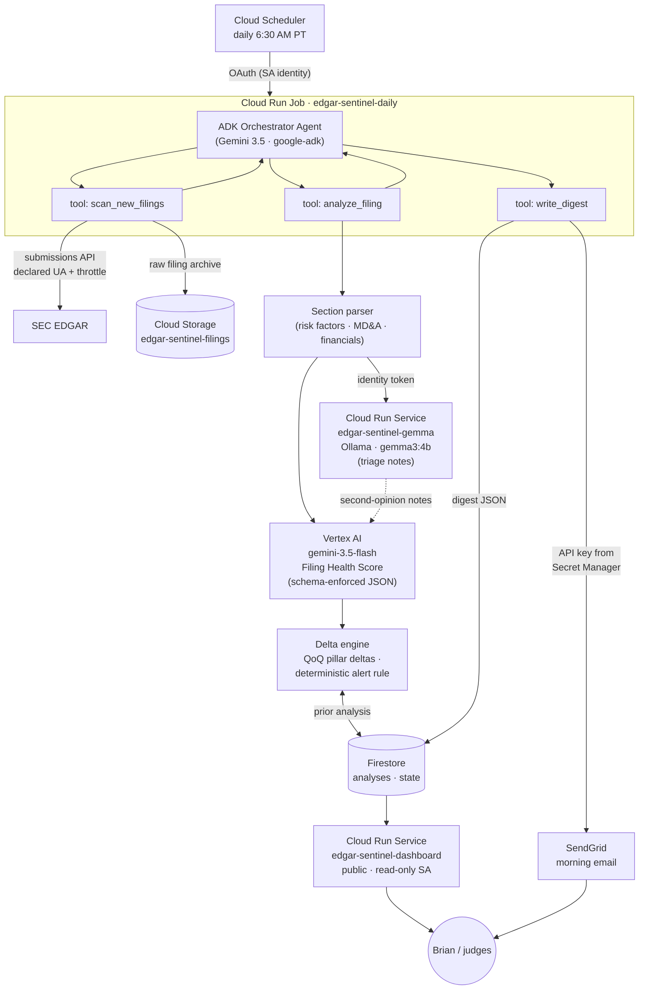

# Architecture

**Design principle: agentic control flow, deterministic execution.** The ADK
orchestrator (Gemini) decides *what* runs and writes the run report; tested
Python decides *what is true* — section slicing, FHS weighting, the alert rule,
and state transitions are all deterministic, reproducible code.

**Isolation:** three service identities — the job (Vertex user + Firestore user +
bucket writer + Gemma invoker + secret accessor), the Gemma service (private,
invoker-only), and the dashboard (public but datastore.viewer *only*). No
credential appears in code, images, or the repo; the only secret lives in
Secret Manager.

**Cost posture:** Gemma runs scale-to-zero on CPU and is scoped to the
risk-factors section; the analyst uses Gemini Flash with temperature 0; the
job runs ~1 minute per filing; the app does not need to stay hot — Cloud Run
scales everything to zero between runs.
